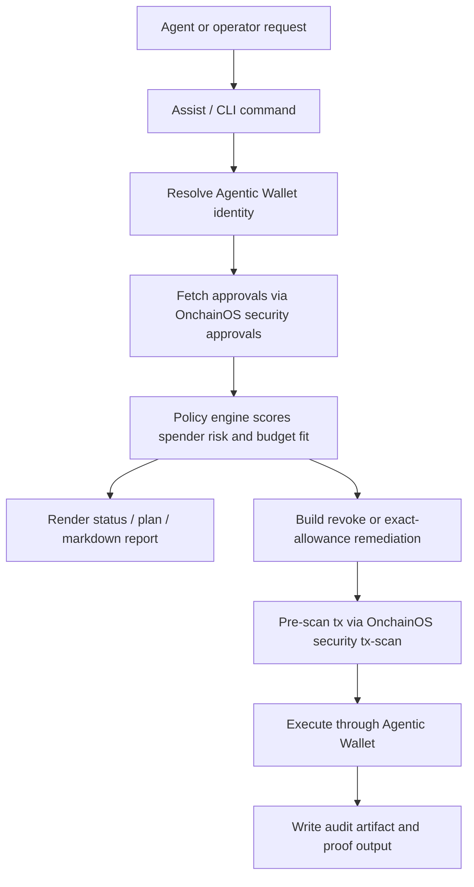

# OKX Approval Firewall

`OKX Approval Firewall` is an agent-native approval firewall for `X Layer` wallets.

It turns raw `OnchainOS` approval and transaction-security primitives into a reusable operator skill that can:

- inspect ERC-20 approval exposure
- score approval health under policy presets
- enforce local spender budgets from a policy file
- replace unlimited approvals with exact allowances
- explain the next safest action in plain language
- preflight remediation paths with `tx-scan` before live execution
- expose the full review and execution loop in a lightweight operator dashboard
- emit markdown and JSON artifacts for auditability
- log every live remediation run to a local audit trail
- verify the post-run approval state after cleanup

Built for the `OKX Build X Hackathon`, the project focuses on a practical agent-ops problem: agents can trade, bridge, and pay, but permissions often linger after execution. Approval hygiene should be part of the runtime, not an afterthought.

## Project Intro

OKX Approval Firewall is a CLI and reusable skill for agent operators on X Layer.

It helps agents and humans answer four practical questions:

1. What approvals are active right now?
2. Which ones are unsafe, oversized, or out of policy?
3. How should those approvals be reduced or revoked?
4. Can we remediate them live and keep a clean audit trail?

The operator loop is intentionally compact:

- `assist` turns natural-language requests into the safest workflow
- `dashboard` gives the operator a visual control room with live X Layer review cards
- `review` combines approval state, top findings, and dry-run remediation preflight
- `execute --apply` verifies the after-state so the operator can see what changed

## Project Positioning In The X Layer Ecosystem

Most X Layer agent projects focus on execution: swapping, routing, bridging, or paying. `OKX Approval Firewall` is positioned as the permission-control layer that sits around those actions.

It is not another trading bot and it is not a generic revoke button.

It is built for the missing agent-ops layer on X Layer:

- unlimited approvals should not linger after execution
- trusted spenders still need spend budgets
- risky or blocked spenders should be removed automatically
- every cleanup should leave behind a machine-readable artifact a human can review

Core thesis: `agents need a permission firewall, not just a revoke button`.

## Architecture Overview

OKX Approval Firewall is intentionally simple and operator-first:

- `OnchainOS security approvals` inventories current ERC-20 approval state
- `OnchainOS security tx-scan` checks remediation transactions before execution
- `OnchainOS wallet balance` resolves the active Agentic Wallet identity when needed
- `OnchainOS wallet contract-call` submits live revoke and exact-approval transactions
- local `policy-as-code` files define trusted, watchlisted, and blocked spenders
- local audit artifacts preserve execution results for human review

Main execution loop:

1. fetch approvals
2. classify approvals under a policy preset and optional local config
3. generate a health summary, plan, and report
4. preflight remediation safety with `tx-scan`
5. execute cleanup or exact-allowance replacement on X Layer
6. verify the post-run state and write a machine-readable audit artifact



## Onchain Identity And Deployment Address

- Primary Agentic Wallet address:
  `0x5b6a6bc856fba3e3ac9fe4e9368d2aa3090990c8`
- Target chain:
  `X Layer`
- Chain ID:
  `196`
- Deployment identity for this Skills Arena submission:
  the Agentic Wallet above is the onchain identity that performs live remediation
- Custom deployed contracts:
  `None in this version`

This milestone is intentionally focused on the agent permission layer rather than a custom smart-contract protocol.

## OnchainOS / Uniswap Skill Usage

This project is intentionally built around `OnchainOS` security primitives and `Agentic Wallet` execution. The approval-firewall use case does not require Uniswap integration to deliver its core safety value.

### OnchainOS modules used

- `security approvals`
  inventories current approval exposure for the wallet
- `security tx-scan`
  checks revoke and exact-allowance remediation calls before execution
- `wallet balance`
  resolves the active Agentic Wallet EVM identity
- `wallet contract-call`
  executes live approval cleanup and exact re-grants

### How the integration works

1. The operator or agent asks for a wallet health check, plan, report, or cleanup.
2. The tool fetches approval state through `OnchainOS security approvals`.
3. The local policy engine classifies each approval as `keep`, `review`, `revoke`, or `replace_with_exact_approval`.
4. Remediation transactions are encoded and passed through `OnchainOS security tx-scan`.
5. Live execution goes through `Agentic Wallet` with `wallet contract-call`.
6. The run is written to a local audit artifact for later review.

## AI Interactive Experience

The project now includes an agent-facing `assist` command that interprets natural-language operator requests and routes them to the safest matching workflow.

For judges or operators who want a more visual surface, the local `dashboard` command wraps the same review, brief, and execute workflows in a lightweight web UI.

When an OpenAI-compatible API key is configured, `assist` upgrades from heuristic routing to model-backed request interpretation. The `brief` command can also produce a model-backed operator briefing from live approval state.

For operators who want one command instead of a multi-step workflow, `review` runs a complete approval review with top findings, dry-run remediation preflight, and the safest next command. If no policy is provided, the tool falls back to the config default or `strict`.

Examples:

```bash
npm run dev -- assist --input "Check my wallet health on X Layer"
npm run dev -- dashboard
npm run dev -- assist --input "Generate a markdown report for my approvals" --output .okx-approval-firewall/demo-report.md
npm run dev -- assist --input "Clean up risky approvals but keep trading routers active" --config okx-approval-firewall.policy.json
npm run dev -- assist --input "Revoke anything unsafe now" --model gpt-4o-mini
npm run dev -- review --with-brief
npm run dev -- assist --input "Revoke anything unsafe now" --policy strict --apply
npm run dev -- brief --policy strict --address 0xYourWallet
```

Why this matters for the product:

- agents can issue natural-language safety requests instead of memorizing command combinations
- judges and operators can inspect the same engine through either the CLI or the dashboard without diverging behavior
- the tool can use a model-backed interpretation layer when credentials are configured, with safe heuristic fallback when they are not
- broader safety prompts now default to the richer `review` workflow instead of a thinner status-only summary
- the tool explains the interpreted intent, chosen policy, safety mode, and next command
- operators can generate a model-backed narrative briefing from the live approval state when an LLM endpoint is configured
- live remediation still requires explicit `--apply`, so conversational control does not bypass execution safety
- wallet and transaction outputs surface direct `OKX Explorer` links for X Layer where applicable

## Product Surface

The CLI includes:

- `dashboard`: local visual control room for review, brief, and live execution
- `assist`: natural-language routing for approval inspection, planning, reporting, and cleanup
- `review`: full approval review with top findings, tx-scan preflight, and the safest next command
- `brief`: optional model-backed operator briefing from live approval state
- `status`: one-screen wallet health summary and next action
- `inspect`: raw approval inventory for a wallet
- `plan`: policy-driven decisions for each approval
- `report`: markdown or JSON submission artifact
- `execute`: live cleanup, exact-allowance remediation, and post-run verification
- `audit`: local execution history with artifact, verification delta, and tx references

## Working Mechanics

The operational flow is:

1. `review` gives the operator a complete high-signal pass and previews cleanup safety
2. `dashboard` turns that same review flow into a visual operator surface
3. `status` surfaces the current wallet approval health
4. `inspect` shows raw exposure
5. `plan` applies the chosen preset and local config
6. `report` produces a shareable artifact
7. `execute --apply` revokes unsafe approvals, optionally re-grants an exact budget, and verifies the resulting state
8. `audit` shows the recorded local artifact, verification delta, and tx references

CLI help:

```bash
node dist/cli.js --help
```

## Live Proof

The current build has been tested live on X Layer with the project Agentic Wallet.

Verified transactions:

- setup unlimited approval: `0x23423ae4622271d62070c356305e06b803d62cb486aca426ff0aa2b399b69481`
- revoke unlimited approval: `0x1e02d66dd26b2a85305e91771cd261e314e80c5407c507a745d91fbcba586d33`
- cleanup leg of exact remediation: `0x4d32af6447c64bb6fc8cda31a2779a6f3912a7450401e7ff17c9281c18968fb4`
- exact regrant leg of exact remediation: `0x8e675c89d98ecf38ebe5525514c60d513d4cd173f569652b85919326c7d445cf`

The successful exact-remediation run also produced a local audit artifact at:

- `.okx-approval-firewall/runs/2026-04-12T16-47-55-954Z-execute.json`

## Requirements

- Node.js 22+
- `onchainos` CLI installed and authenticated
- Agentic Wallet access for live execution

## Quickstart

```bash
npm install
npm run build
```

Use the sample policy file as a starting point:

```bash
cp okx-approval-firewall.policy.example.json okx-approval-firewall.policy.json
```

Natural-language assistant mode:

```bash
npm run dev -- assist --input "Check my wallet health on X Layer"
```

Local dashboard:

```bash
npm run dev -- dashboard
```

One-command review mode:

```bash
npm run dev -- review --with-brief
```

Model-backed briefing mode:

```bash
npm run dev -- brief --policy strict --address 0xYourWallet
```

Environment variables for model-backed `assist` and `brief`:

```bash
export APPROVAL_FIREWALL_LLM_API_KEY=...
export APPROVAL_FIREWALL_LLM_MODEL=gpt-4o-mini
```

Structured status check:

```bash
npm run dev -- status --address 0xYourWallet --config okx-approval-firewall.policy.json
```

Inspect approvals:

```bash
npm run dev -- inspect --address 0xYourWallet --chain xlayer
```

Generate a policy plan:

```bash
npm run dev -- plan --address 0xYourWallet --config okx-approval-firewall.policy.json
```

Write a markdown report artifact:

```bash
npm run dev -- report --address 0xYourWallet --policy strict --config okx-approval-firewall.policy.json --output .okx-approval-firewall/report.md
```

Preview live cleanup:

```bash
npm run dev -- execute --address 0xYourWallet --policy strict --config okx-approval-firewall.policy.json
```

Apply live cleanup and exact remediation:

```bash
npm run dev -- execute --address 0xYourWallet --policy strict --config okx-approval-firewall.policy.json --apply
```

Review recent live runs:

```bash
npm run dev -- audit
```

Run the full verification loop:

```bash
npm run ci
```

## Policy-As-Code

OKX Approval Firewall supports a local JSON policy file for spender-specific rules.

Example:

```json
{
  "defaults": {
    "chain": "xlayer",
    "policy": "strict"
  },
  "spenders": {
    "0x8b773d83bc66be128c60e07e17c8901f7a64f000": {
      "label": "Execution Router",
      "trust": "trusted",
      "maxAllowance": "500000",
      "exactAllowance": "250000",
      "notes": [
        "Cap router spend to the smallest amount that still lets the agent execute.",
        "Replace unlimited approvals with an exact allowance on every cleanup cycle."
      ]
    }
  }
}
```

Supported spender controls:

- `trust: trusted` for approved operators with a spend budget
- `trust: watchlist` for spenders that should stay visible in reviews
- `trust: blocked` for immediate revocation
- `maxAllowance` for budget enforcement
- `exactAllowance` for exact regrant after cleanup
- `notes` for operator context in plan and report output

## Repo Structure

- `README.md`: product overview, architecture, proof, and usage
- `skills/okx-approval-firewall/SKILL.md`: reusable skill wrapper
- `okx-approval-firewall.policy.example.json`: starter policy config
- `src/`: CLI commands, policy engine, OnchainOS integration, and audit logging
- `test/`: parser and policy tests
- `.github/workflows/ci.yml`: build and test verification

Key entrypoints:

- `src/cli.ts`
- `src/lib/assist.ts`
- `src/lib/brief.ts`
- `src/lib/okx.ts`
- `src/lib/policy.ts`
- `src/lib/audit.ts`

## Suggested Workflow

The strongest product walkthrough is:

1. Run `assist` with a natural-language wallet safety request.
2. Run `brief` to generate an operator-facing risk narrative.
3. Show `status` to surface the current risk grade.
4. Run `plan` to show why the policy flags an unlimited approval.
5. Run `report --output ...` to create a polished artifact.
6. Run `execute --apply` to revoke the unlimited approval and regrant an exact budget.
7. Run `audit` to show the recorded cleanup and tx hashes.

## Team Members

Solo submission:

- `Kirill Sibirski` — product, engineering, agent operations, and live X Layer validation
- Contact: `kirill.rybkov@outlook.com`
- GitHub: `Kirillr-Sibirski`

If this project later expands into a multi-agent deployment, each agent role will be documented explicitly in this section and in the repo docs.

## Notes

- The tool currently targets ERC-20 approvals first.
- Permit2 awareness is intentionally lightweight in this milestone.
- Approval budget values are expected in raw token units for now.
- Live execution uses `tx-scan` before contract calls and records the resulting artifact locally.
